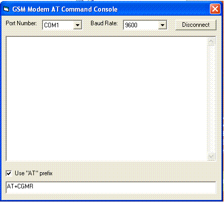



## AT command console

### Description

This is a simple console for AT command. The AT command is commonly use for GSM modem for communication between mobile phone and computer. This app requires a GSM modem plugged on the computer.
 
### More Info
 

             |
---                |---
**Submitted On**   |2012-03-24 23:41:00
**By**             |[Martin P\. Rizal](https://github.com/Planet-Source-Code/PSCIndex/blob/master/ByAuthor/martin-p-rizal.md)
**Level**          |Intermediate
**User Rating**    |5.0 (10 globes from 2 users)
**Compatibility**  |VB 6\.0
**Category**       |[Miscellaneous](https://github.com/Planet-Source-Code/PSCIndex/blob/master/ByCategory/miscellaneous__1-1.md)
**World**          |[Visual Basic](https://github.com/Planet-Source-Code/PSCIndex/blob/master/ByWorld/visual-basic.md)
**Archive File**   |[AT\_command222466672012\.zip](https://github.com/Planet-Source-Code/martin-p-rizal-at-command-console__1-74384/archive/master.zip)

